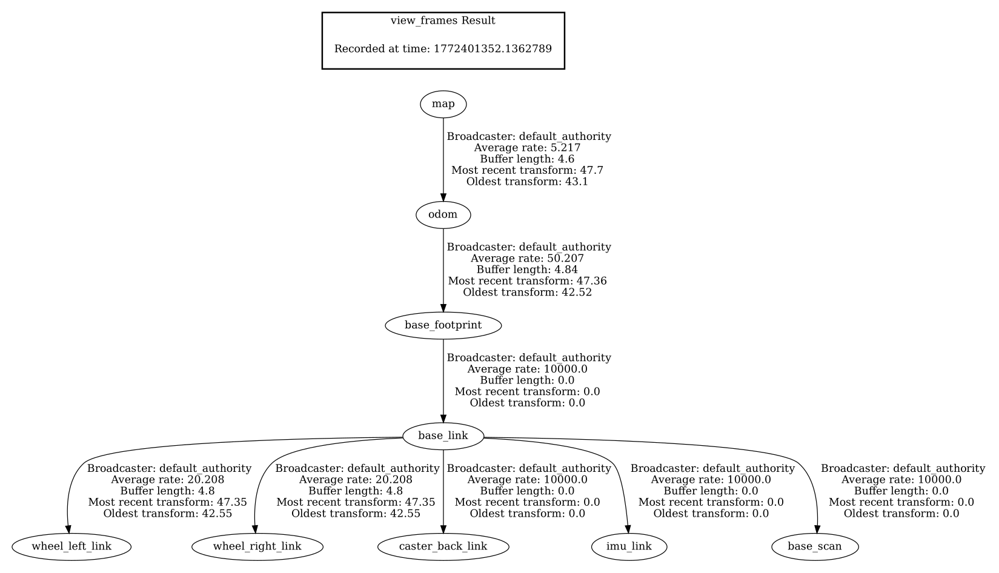

# ROS2 A* Global Planner (TurtleBot3 + AMCL)

This project implements a custom A* global planner in ROS2 (Jazzy) for TurtleBot3 simulation.

The planner:
- Subscribes to `/map` (OccupancyGrid)
- Uses TF to query robot pose (`map -> base_footprint`)
- Subscribes to goal poses from RViz
- Computes a grid-based A* path
- Publishes `nav_msgs/Path` for visualization

## TF Tree



## Architecture

Localization:
- AMCL (particle filter)
- Publishes `map -> odom` transform

Planning:
- Custom Python ROS2 node
- Uses occupancy grid
- 8-connected A* search
- Euclidean heuristic

Visualization:
- RViz Path display
- `/planned_path` topic

---

## Dependencies

- ROS2 Jazzy
- TurtleBot3 packages
- nav_msgs
- geometry_msgs
- tf2_ros

---

## How To Run

### 1. Launch Gazebo
```
ros2 launch turtlebot3_gazebo turtlebot3_world.launch.py
```

### 2. Launch Nav2
```
ros2 launch turtlebot3_navigation2 navigation2.launch.py use_sim_time:=True
```

### 3. Run Planner
```
ros2 run simple_planner planner_node
```

### 4. In RViz

- Set 2D Pose Estimate
- Set 2D Goal Pose
- Add Path display → `/planned_path`

---

## Future Improvements

- Obstacle inflation
- Path smoothing
- Replanning on motion
- RRT* implementation
- Path following controller
